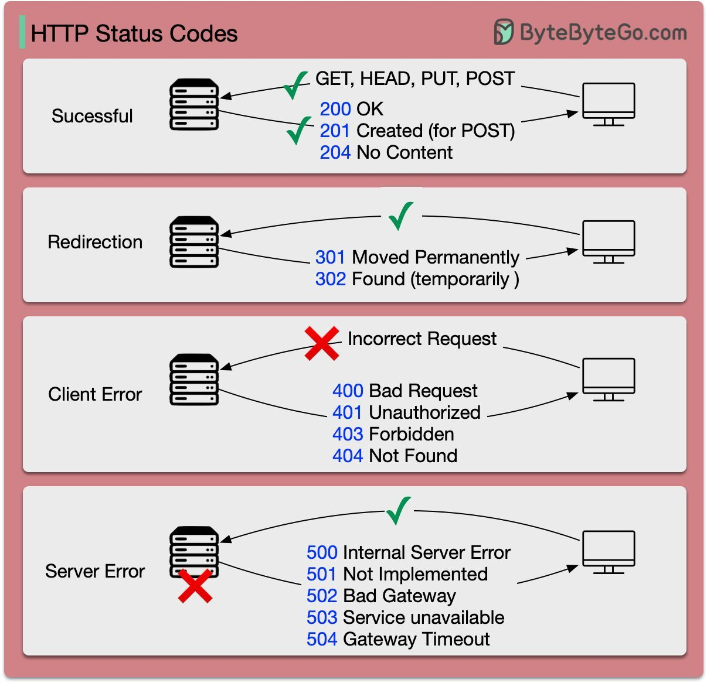

# Swagger

## What is Swagger and why to use swagger

-Swagger is a set of open-source tools built around the OpenAPI Specification that can help you design, build, document and consume REST APIs.

- For the other developers to be able to use our API, the API must be properly documented; otherwise, how would they know that what are the endpoints exposed by the api and what are the operations supported on those endpoints? What parameters should they pass, and what will they get back? What authentication methods to use?.

- To answer these questions, it is very important to document the APIs; if you want APIs to be consumed and properly used.

## Open API Speification

- OpenApi Specification(Swagger Specification) is an API description format for REST APIs.

- An OpenAPI file allows you to describe your entire API, including:

  - Available endpoints (/users) and operations on each endpoint (GET /users, POST /users)
  
  - Operation parameters Input and output for each operation
  
  - Authentication methods
  
  - Contact information, license, terms of use and other information.

- API specifications can be written in YAML or JSON.

## Basic Structure of OpenAPI Specification

- OpenAPI definitions can be written in both YAML or JSON, both are readable by both human and machine.

- Here we have used JSON example:


All keywords are case-sensitive

### Metadata

- Every API definition must include the version of OpenAPI specification or swagger

```text
"swagger": "2.0"
```

- The info section contains API information: description(optional, title,version).

- ```title``` is your API name. ```description``` is extended information about API.

### Schemes

- ```schemes``` are the transfer protocols used by the API.

- Swagger supports the http , https , and WebSocket schemes – ws and wss .

### Host

- ```host``` is the domain name or IP address (IPv4) of the host that serves the API. It may include the port number if different from the scheme’s default port (80 for HTTP and 443 for HTTPS)

### basePath

- basePath is the URL prefix for all API paths, relative to the host root. It must start with a leading slash /. If basePath is not specified, it defaults to /, that is, all paths start at the host root.

### Paths

- The ```paths``` section defines individual endpoints in an API, and operations supported by these endpoints.

- An operation definition can include ```parameteres```, ```requestBody```, response status code(200 OK, 4040 Not Found) and response contents.

#### Parameteres

- Operations can have parameteres passed via URL path ```/chat/reply/{language}```, query string ```/chat/reply?language=twi```.

- **name**: It is the key that denotes the name of the parameter.

- **in**: It is the key that defines the parameter as a query-based parameter.

- **required**: In the above, the value of this key is false which means that it is an optional field.

- **type**: It is the key that defines the type of the parameter.

- **example**: You can add examples to parameters, properties and objects to make OpenAPI specification of your web service clearer. Examples can be read by tools and libraries that process your API in some way.

#### Request Body

- If an operation sends a request body use ```requestBody``` keyword to describe the body content and type.

#### Responses

- For each operation, you can definer possible status code, such as 200 OK or 404 Not Found, and the response body schema.


#### Input and Output Models

- The global schemas section lets us to define common data structures used in API. They can be referenced with ```$ref``` whenever a schema is required in parameteres, request body, response body.

```text
"data":{
    "type": "string,
    "example": "hello"
}
```
